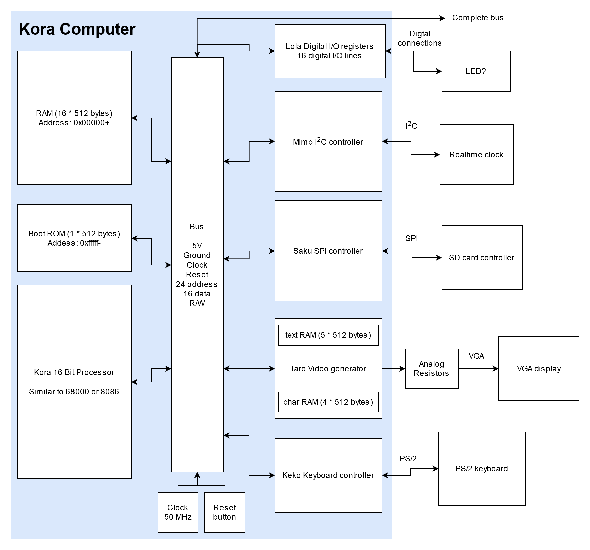
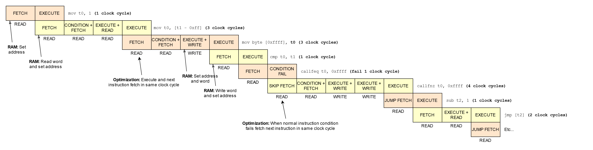

# The Kora 16-bit Processor Project
The Kora processor is a new processor based on the Neva processor, but extremely expanded and better in every way.
The processor has a classic CISC instruction which is inspired by the x86, 68000, ARM and RISC-V instruction sets.

Made by [Bastiaan van der Plaat](https://bastiaan.ml/)

<br/>

## Two different targets
What is new is that I want to run the processor on two different platforms, namely:

- Web Simulator version like [neva-processor.ml](https://neva-processor.ml/)
   - Web (JavaScript) Kora Assembler
- Altera Cyclone II FPGA dev board version
   - Modern (C) Kora Assembler
   - Native (Kora Assembly) Kora Assembler

<br/>

## Pages that inspired this project
- https://en.wikipedia.org/wiki/Intel_80386
- https://en.wikipedia.org/wiki/ARM_architecture
- https://en.wikipedia.org/wiki/Motorola_68000
- https://en.wikipedia.org/wiki/RISC-V
- https://en.wikipedia.org/wiki/X86_instruction_listings
- http://unixwiz.net/techtips/x86-jumps.html

<br/>

## Complete computer design
As I said, I want the kora processor to become a complete computer platform, which also includes peripheral equipment, eventually I want to keep this design for the complete computer:



<br/>

## The new things compared to the Neva processor
- A new simple 16-bit design like the Neva processor
- A 24-bit external segmented address bus so much more memory access (2 ** 24 = 16 MB)
- A 16-bit data bus interface with the memory
- 6 or 8 more general purpose registers
- Taro video controller intergration
- New segement based memory model vs difficult banking model
- Variable instruction length encoding
- All instructions are conditional
- More flags and so conditions for instructions
- Some new instructions
- An efficient instruction pipeline

<br/>

## Some things I like to include in the future
- A small instruction and data cache (like a Harvard design)
- A hardware interupt system (for keyboard and vsync)
- A multiply and division instruction extention

<br/>

## Instruction pipeline
The Kora processor has an efficient but may be difficult instruction pipeline design:



<br/>

## Instruction encoding
Like the Neva processor, I have kept the instruction encoding quite simple, the mode value determines how the instruction is formed:


<br/>

## Registers

The Kora processor has way more registers than the Neva processor, this ensures that code can better be optimized:

<table>

<tr><th>#</th><th>Names</th><th>Meaning</th><th>Calling convetion</th></tr>

<tr><td colspan="4"><i>General purpose registers:</i></td></tr>
<tr><td>0</td><td><code>r0</code>, <code>a</code>, <code>t0</code></td><td>General purpose A register</td><td>Temporary variable 1</td></tr>
<tr><td>1</td><td><code>r1</code>, <code>b</code>, <code>t1</code></td><td>General purpose B register</td><td>Temporary variable 2</td></tr>
<tr><td>2</td><td><code>r2</code>, <code>c</code>, <code>t2</code></td><td>General purpose C register</td><td>Temporary variable 3</td></tr>
<tr><td>3</td><td><code>r3</code>, <code>d</code>, <code>s0</code></td><td>General purpose D register</td><td>Saved variable 1</td></tr>
<tr><td>4</td><td><code>r4</code>, <code>e</code>, <code>s1</code></td><td>General purpose E register</td><td>Saved variable 2</td></tr>
<tr><td>5</td><td><code>r5</code>, <code>f</code>, <code>s2</code></td><td>General purpose F register</td><td>Saved variable 3</td></tr>
<tr><td>6</td><td><code>r6</code>, <code>g</code>, <code>a0</code></td><td>General purpose G register</td><td>Function argument 1 / Return argument 1</td></tr>
<tr><td>7</td><td><code>r7</code>, <code>h</code>, <code>a1</code></td><td>General purpose H register</td><td>Function argument 2 / Return argument 2</td></tr>
<tr><td>8</td><td><code>r8</code>, <code>i</code>, <code>a2</code></td><td>General purpose I register</td><td>Function argument 3</td></tr>
<tr><td>9</td><td><code>r9</code>, <code>j</code>, <code>a3</code></td><td>General purpose J register</td><td>Function argument 4</td></tr>
<tr><td>10</td><td><code>r10</code>, <code>k</code>, <code>bp</code></td><td>General purpose K register</td><td>Stack base pointer</td></tr>
<tr><td>11</td><td><code>r11</code>, <code>l</code>, <code>rp</code></td><td>General purpose L register</td><td>Return / previous instruction pointer</td></tr>
<tr><td colspan="4"></td></tr>

<tr><td colspan="4"><i>Processor used registers:</i></td></tr>
<tr><td>12</td><td><code>r12</code>, <code>sp</code></td><td>Stack pointer register</td><td>-</td></tr>
<tr><td>13</td><td><code>r13</code>, <code>ds</code></td><td>Data segment register</td><td>-</td></tr>
<tr><td>14</td><td><code>r14</code>, <code>ss</code></td><td>Stack segment register</td><td>-</td></tr>
<tr><td>15</td><td><code>r15</code>, <code>flags</code></td><td>Flags register</td><td>-</td></tr>
<tr><td colspan="4"></td></tr>

<tr><td colspan="4"><i>Unaccessible processor used registers:</i></td></tr>
<tr><td>16</td><td><code>r16</code>, <code>ip</code></td><td>Instruction pointer register</td><td>-</td></tr>
<tr><td>17</td><td><code>r17</code>, <code>cs</code></td><td>Code segment register</td><td>-</td></tr>

</table>

<br/>

## Flags

<table>

<tr><th>#</th><th>Name</th><th>Meaning</th></tr>

<tr><td colspan="4"><i>General flags:</i></td></tr>
<tr><td>0</td><td>Carry</td><td>Is set when a carry overflow occurs</td></tr>
<tr><td>1</td><td>Zero</td><td>Is set when the result is zero</td></tr>
<tr><td>2</td><td>Sign</td><td>Is set when the sign bit is set</td></tr>
<tr><td>3</td><td>Overflow</td><td>Is set when a overflow occurs</td></tr>
<tr><td>4 - 7</td><td><i>Reserved</i></td><td>-</td></tr>
<tr><td colspan="4"></tr>

<tr><td colspan="4"><i>Processor flags:</i></td></tr>
<tr><td>8</td><td>Halt</td><td>When set halts the processor</td></tr>
<tr><td>9 - 15</td><td><i>Reserved</i></td><td>-</td></tr>

</table>

<br/>

## Conditions

Unlike the Neva processor every instructions is conditional, this can benefit some assembly patterns:

<table>

<tr><th>#</th><th>Name</th><th>Meaning</th><th>Condition</th></tr>

<tr><td>0</td><td><code>-</code></td><td>Always</td><td><code>true</code></tr>
<tr><td>1</td><td><code>-n</code></td><td>Never</td><td><code>false</code></tr>
<tr><td colspan="4"></tr>

<tr><td>2</td><td><code>-c</code></td><td>Carry</td><td><code>carry</code></tr>
<tr><td>3</td><td><code>-nc</code></td><td>Not carry</td><td><code>!carry</code></tr>
<tr><td colspan="4"></tr>

<tr><td>4</td><td><code>-z</code></td><td>Zero</td><td><code>zero</code></tr>
<tr><td>5</td><td><code>-nz</code></td><td>Not zero</td><td><code>!zero</code></tr>
<tr><td colspan="4"></tr>

<tr><td>6</td><td><code>-s</code></td><td>Sign</td><td><code>sign</code></tr>
<tr><td>7</td><td><code>-ns</code></td><td>Not sign</td><td><code>!sign</code></tr>
<tr><td colspan="4"></tr>

<tr><td>8</td><td><code>-o</code></td><td>Overflow</td><td><code>overflow</code></tr>
<tr><td>9</td><td><code>-no</code></td><td>Not Overflow</td><td><code>!overflow</code></tr>
<tr><td colspan="4"></tr>

<tr><td>10</td><td><code>-a</code></td><td>Above</td><td><code>!carry && !zero</code></tr>
<tr><td>11</td><td><code>-na</code></td><td>Not above</td><td><code>carry || zero</code></tr>
<tr><td colspan="4"></tr>

<tr><td>12</td><td><code>-l</code></td><td>Lesser</td><td><code>sign != overflow</code></tr>
<tr><td>13</td><td><code>-nl</code></td><td>Not lesser</td><td><code>sign == overflow</code></tr>
<tr><td colspan="4"></tr>

<tr><td>14</td><td><code>-g</code></td><td>Greater</td><td><code>zero && sign == overflow</code></tr>
<tr><td>15</td><td><code>-ng</code></td><td>Not greater</td><td><code>!zero || sign != overflow</code></tr>

</table>

<br/>

## Kora (re)starts jump address
When Kora (re)starts the instruction pointer register is set to `0x0000` and the code segment register is set to `0xffff`
So the processor starts executing code at `0xffffff00`

<br/>

## Instructions

Comming soon...

<br/>

## CPUID instruction
This instruction is used to fetch information about the processor and it will set these registers:

```
a0 = 0x2807 ; Processor Manufacter id
   ; 0x2807 = Bastiaan van der Plaat
a1 = 0xB0EF ; Processor id
   ; 0xB0EF = Kora Processor
a2 = 0x00 01; Processor version first byte '.' last byte
a3 = 0b00000000 00000001 ; Processor features bit list
   ; 0 = Multiply / Division extention
   ; 1 = Software / hardware Interupt extention
   ; 8 = Taro video generator chip
   ; 9 = Kiki PS/2 keyboard interface chip
   ; 10 = SD card storage device?? (need I2C, SPI)
   ; Etc...
t1 = 0x0000 ; Processor Manufacter Date Low Unix Timestamp
t2 = 0x0000 ; Processor Manufacter Date High Unix Timestamp
```
