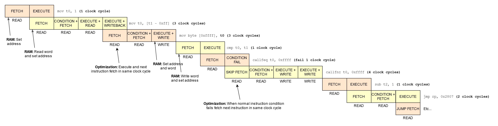
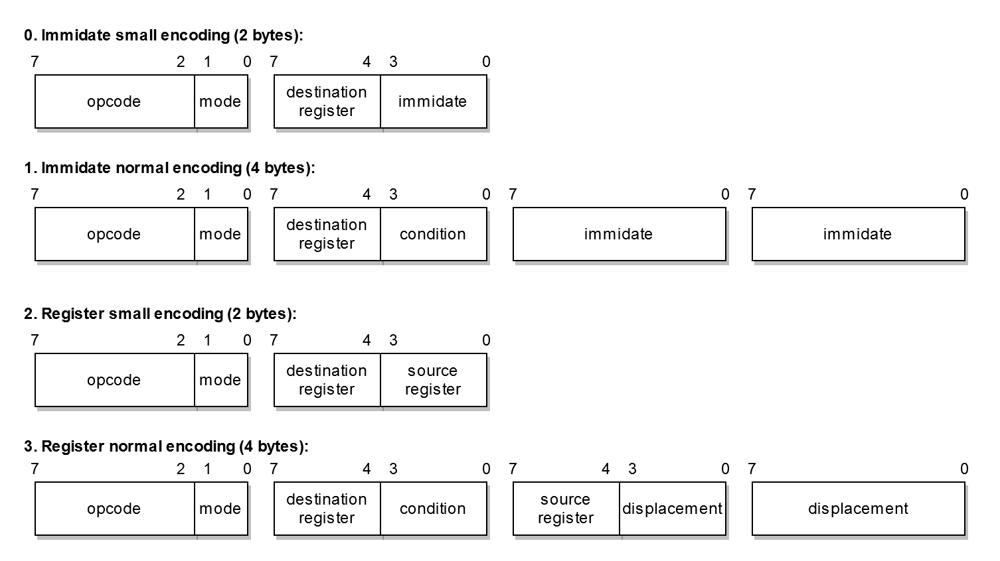

# The Kora 16-bit Processor Project
The Kora processor is a simple 16-bit CISC processor with RISC features

## Pages that inspired the Kora processor
- https://en.wikipedia.org/wiki/Intel_8086
- https://en.wikipedia.org/wiki/ARM_architecture
- https://en.wikipedia.org/wiki/Motorola_68000
- https://en.wikipedia.org/wiki/RISC-V
- https://en.wikipedia.org/wiki/X86_instruction_listings
- http://unixwiz.net/techtips/x86-jumps.html

## Features
- A new simple 16-bit CISC design with RISC features like the Neva processor
- A 24-bit external segmented address bus so much more memory access (2 ** 24 = 16 MB)
- A 16-bit data bus interface with the memory
- 12 general purpose registers (10 more)
- New segement based memory model vs difficult banking model
- Variable instruction length encoding
- All instructions are conditional
- More flags and so conditions for instructions
- Some new instructions
- A better extendable base instruction set
- A hardware interupt system (for keyboard and vsync)
- An efficient instruction pipeline

## Instruction pipeline
The ultimate goal is to create an efficient instruction pipeline so that no clock cycles are wasted:



## Memory interface
The Kora processor is connected with a simple 24-bit address and a 16-bit data bus to the RAM. The processor can read or write a word (16-bits off data) every clock cycle. The processor will read the data in the next clock cyle when it has put a read command on the bus. All words must be aligned on a word bassis to keep the design simple. So you can read a word on an uneven address! This is important because otherwise the processor wil crash or get in an unkown state.

## Instruction encoding
Like the Neva processor, I have kept the instruction encoding quite simple, the mode value determines how the instruction is formed:



## Registers
The Kora processor has way more registers than the Neva processor, this ensures that code can better be optimized:

<table>
<tr><th>#</th><th>Names</th><th>Meaning</th></tr>

<tr><td colspan="3"><i>General purpose registers:</i></td></tr>
<tr><td>0</td><td><code>r0</code>, <code>a</code></td><td>General purpose A register</td></tr>
<tr><td>1</td><td><code>r1</code>, <code>b</code></td><td>General purpose B register</td></tr>
<tr><td>2</td><td><code>r2</code>, <code>c</code></td><td>General purpose C register</td></tr>
<tr><td>3</td><td><code>r3</code>, <code>d</code></td><td>General purpose D register</td></tr>
<tr><td>4</td><td><code>r4</code>, <code>e</code></td><td>General purpose E register</td></tr>
<tr><td>5</td><td><code>r5</code>, <code>f</code></td><td>General purpose F register</td></tr>
<tr><td>6</td><td><code>r6</code>, <code>g</code></td><td>General purpose G register</td></tr>
<tr><td>7</td><td><code>r7</code>, <code>h</code></td><td>General purpose H register</td></tr>
<tr><td>8</td><td><code>r8</code>, <code>i</code></td><td>General purpose I register</td></tr>
<tr><td>9</td><td><code>r9</code>, <code>j</code></td><td>General purpose J register</td></tr>
<tr><td>10</td><td><code>r10</code>, <code>k</code></td><td>General purpose K register</td></tr>
<tr><td>11</td><td><code>r11</code>, <code>l</code></td><td>General purpose L register</td></tr>
<tr><td colspan="3"></td></tr>

<tr><td colspan="3"><i>Processor used registers:</i></td></tr>
<tr><td>12</td><td><code>r12</code>, <code>ds</code></td><td>Data segment register</td></tr>
<tr><td>13</td><td><code>r13</code>, <code>ss</code></td><td>Stack segment register</td></tr>
<tr><td>14</td><td><code>r14</code>, <code>sp</code></td><td>Stack pointer register</td></tr>
<tr><td>15</td><td><code>r15</code>, <code>flags</code></td><td>Flags register</td></tr>
<tr><td colspan="3"></td></tr>

<tr><td colspan="3"><i>Unaccessible processor used registers:</i></td></tr>
<tr><td>16</td><td><code>r16</code>, <code>cs</code></td><td>Code segment register</td></tr>
<tr><td>17</td><td><code>r17</code>, <code>ip</code></td><td>Instruction pointer register</td></tr>
</table>

## Flags
The kora processor has general flags and processor state flags, all flags are stored in the `flags` register:

<table>
<tr><th>#</th><th>Name</th><th>Meaning</th></tr>

<tr><td colspan="4"><i>General flags:</i></td></tr>
<tr><td>0</td><td>Carry</td><td>Is set when a carry overflow occurs</td></tr>
<tr><td>1</td><td>Zero</td><td>Is set when the result is zero</td></tr>
<tr><td>2</td><td>Sign</td><td>Is set when the sign bit is set</td></tr>
<tr><td>3</td><td>Overflow</td><td>Is set when a overflow occurs</td></tr>
<tr><td colspan="4"></td></tr>

<tr><td>4/7</td><td><i>Reserved</i></td><td>-</td></tr>
<tr><td colspan="4"></td></tr>

<tr><td colspan="4"><i>Processor flags:</i></td></tr>
<tr><td>8</td><td>Halt</td><td>When set halts the processor</td></tr>
<tr><td>9</td><td>Interrupt</td><td>When set the processor enables hardware and software interrupts</td></tr>
<tr><td colspan="4"></td></tr>

<tr><td>10/15</td><td><i>Reserved</i></td><td>-</td></tr>
</table>

## Conditions
Unlike the Neva processor every instructions is conditional, this can benefit some assembly patterns:

<table>
<tr><th>#</th><th>Name</th><th>Meaning</th><th>Other names</th><th>Condition</th></tr>

<tr><td>0</td><td><code>-</code></td><td>Always</td><td>-</td><td><code>true</code></td></tr>
<tr><td>1</td><td><code>-n</code></td><td>Never</td><td>-</td><td><code>false</code></td></tr>
<tr><td colspan="5"></td></tr>

<tr><td>2</td><td><code>-c</code></td><td>Carry</td><td><code>-b</code> Below (unsigned)<br/><code>-nae</code> Not above or equal (unsigned)</td><td><code>carry</code></td></tr>
<tr><td>3</td><td><code>-nc</code></td><td>Not carry</td><td><code>-nb</code> Not below (unsigned)<br/><code>-ae</code> Above or equal (unsigned)</td><td><code>!carry</code></td></tr>
<tr><td colspan="5"></td></tr>

<tr><td>4</td><td><code>-z</code></td><td>Zero</td><td><code>-e</code> Equal</td><td><code>zero</code></td></tr>
<tr><td>5</td><td><code>-nz</code></td><td>Not zero</td><td><code>-ne</code> Not equal</td><td><code>!zero</code></td></tr>
<tr><td colspan="5"></td></tr>

<tr><td>6</td><td><code>-s</code></td><td>Sign</td><td>-</td><td><code>sign</code></td></tr>
<tr><td>7</td><td><code>-ns</code></td><td>Not sign</td><td>-</td><td><code>!sign</code></td></tr>
<tr><td colspan="5"></td></tr>

<tr><td>8</td><td><code>-o</code></td><td>Overflow</td><td>-</td><td><code>overflow</code></td></tr>
<tr><td>9</td><td><code>-no</code></td><td>Not Overflow</td><td>-</td><td><code>!overflow</code></td></tr>
<tr><td colspan="5"></td></tr>

<tr><td>10</td><td><code>-a</code></td><td>Above</td><td><code>-nbe</code> Not below or equal (unsigned)</td><td><code>!carry &amp;&amp; !zero</code></td></tr>
<tr><td>11</td><td><code>-na</code></td><td>Not above</td><td><code>-be</code> Below or equal (unsigned)</td><td><code>carry || zero</code></td></tr>
<tr><td colspan="5"></td></tr>

<tr><td>12</td><td><code>-l</code></td><td>Less</td><td><code>-nge</code> Not greater or equal (signed)</td><td><code>sign != overflow</code></td></tr>
<tr><td>13</td><td><code>-nl</code></td><td>Not less</td><td><code>-ge</code> Greater or equal (signed)</td><td><code>sign == overflow</code></td></tr>
<tr><td colspan="5"></td></tr>

<tr><td>14</td><td><code>-g</code></td><td>Greater</td><td><code>-nle</code> Not less or equal (signed)</td><td><code>zero &amp;&amp; (sign == overflow)</code></td></tr>
<tr><td>15</td><td><code>-ng</code></td><td>Not greater</td><td><code>-le</code> Less or equal (signed)</td><td><code>!zero || (sign != overflow)</code></td></tr>
</table>

An instruction sets only the processor flags when the condition is set to `-` always unless it is the `cmp` or `test` instruction.

## Kora (re)starts jump address
When Kora (re)starts the instruction pointer register is set to `0x0000` and the code segment register is set to `0xffff`
So the processor starts executing code at `0xffffff00`

## Instructions
The Kora processor has more general instructions then the Neva processor and is also very extendable:

<table>
<tr><th>#</th><th>Name</th><th>Meaning</th><th>Operation</th><th>Flags</th></tr>

<tr><td colspan="5"><i>Special instructions (2):</i></td></tr>
<tr><td>0</td><td><code>nop</code></td><td>No operation</td><td>-</td><td>-</td></tr>
<tr><td>1</td><td><code>cpuid</code></td><td>Get processor information</td><td>* See cpuid section</td><td>-</td></tr>
<tr><td colspan="5"></td></tr>

<tr><td colspan="5"><i>Move, load and store instructions (6):</i></td></tr>
<tr><td>2</td><td><code>mov</code></td><td>Move data</td><td><code>dest = data</code></td><td><code>0</code>, <code>z</code>, <code>s</code>, <code>0</code></td></tr>
<tr><td>3</td><td><code>lw</code></td><td>Load word (16-bit) from memory</td><td><code>dest = [(ds &lt;&lt; 8) + data]</code></td><td><code>0</code>, <code>z</code>, <code>s</code>, <code>0</code></td></tr>
<tr><td>4</td><td><code>lb</code></td><td>Load unsigned byte (8-bit) from memory</td><td><code>dest = [(ds &lt;&lt; 8) + data] &amp; 0x00ff</code></td><td><code>0</code>, <code>z</code>, <code>s</code>, <code>0</code></td></tr>
<tr><td>5</td><td><code>lbs</code></td><td>Load signed byte (8-bit) from memory</td><td><code>dest = signed([(ds &lt;&lt; 8) + data] &amp; 0x00ff)</code></td><td><code>0</code>, <code>z</code>, <code>s</code>, <code>0</code></td></tr>
<tr><td>6</td><td><code>sw</code></td><td>Store word (16-bit) to memory</td><td><code>[(ds &lt;&lt; 8) + data] = dest</code></td><td>-</td></tr>
<tr><td>7</td><td><code>sb</code></td><td>Store word (8-bit) to memory</td><td><code>[(ds &lt;&lt; 8) + data] = dest &amp; 0x00ff</code></td><td>-</td></tr>
<tr><td colspan="5"></td></tr>

<tr><td colspan="5"><i>Arithmetic instructions (6):</i></td></tr>
<tr><td>8</td><td><code>add</code></td><td>Add</td><td><code>dest += data</code></td><td><code>c</code>, <code>z</code>, <code>s</code>, <code>o</code></td></tr>
<tr><td>9</td><td><code>adc</code></td><td>Add with carry</td><td><code>dest += data + carry</code></td><td><code>c</code>, <code>z</code>, <code>s</code>, <code>o</code></td></tr>
<tr><td>10</td><td><code>sub</code></td><td>Subtract</td><td><code>dest -= data</code></td><td><code>c</code>, <code>z</code>, <code>s</code>, <code>o</code></td></tr>
<tr><td>11</td><td><code>sbb</code></td><td>Subtract with borrow</td><td><code>dest -= data + borrow</code></td><td><code>c</code>, <code>z</code>, <code>s</code>, <code>o</code></td></tr>
<tr><td>12</td><td><code>neg</code></td><td>Negate</td><td><code>dest = -data</code></td><td><code>c</code>, <code>z</code>, <code>s</code>, <code>o</code></td></tr>
<tr><td>13</td><td><code>cmp</code></td><td>Compare</td><td><code>dest - data (always set flags)</code></td><td><code>c</code>, <code>z</code>, <code>s</code>, <code>o</code></td></tr>
<tr><td colspan="5"></td></tr>

<tr><td colspan="5"><i>Bitwise instructions (8):</i></td></tr>
<tr><td>14</td><td><code>and</code></td><td>Logical and</td><td><code>dest &amp;= data</code></td><td><code>0</code>, <code>z</code>, <code>s</code>, <code>0</code></td></tr>
<tr><td>15</td><td><code>or</code></td><td>Logical or</td><td><code>dest |= data</code></td><td><code>0</code>, <code>z</code>, <code>s</code>, <code>0</code></td></tr>
<tr><td>16</td><td><code>xor</code></td><td>Logical xor</td><td><code>dest ^= data</code></td><td><code>0</code>, <code>z</code>, <code>s</code>, <code>0</code></td></tr>
<tr><td>17</td><td><code>not</code></td><td>Logical not</td><td><code>dest = ~data</code></td><td><code>0</code>, <code>z</code>, <code>s</code>, <code>0</code></td></tr>
<tr><td>18</td><td><code>test</code></td><td>Logical compare (and)</td><td><code>dest &amp; data (always set flags)</code></td><td><code>0</code>, <code>z</code>, <code>s</code>, <code>0</code></td></tr>
<tr><td>19</td><td><code>shl</code></td><td>Logical shift left</td><td><code>dest &lt;&lt;= data &amp; 15</code></td><td><code>0</code>, <code>z</code>, <code>s</code>, <code>0</code></td></tr>
<tr><td>20</td><td><code>shr</code></td><td>Logical shift right</td><td><code>dest &gt;&gt;= data &amp; 15</code></td><td><code>0</code>, <code>z</code>, <code>s</code>, <code>0</code></td></tr>
<tr><td>21</td><td><code>sar</code></td><td>Arithmetic shift right</td><td><code>dest &gt;&gt;&gt;= data &amp; 15</code></td><td><code>0</code>, <code>z</code>, <code>s</code>, <code>0</code></td></tr>
<tr><td colspan="5"></td></tr>

<tr><td colspan="5"><i>Stack instructions (2):</i></td></tr>
<tr><td>22</td><td><code>push</code></td><td>Push word (16-bit) on the stack</td><td><code>[(ss &lt;&lt; 8) + sp] = data, sp -= 2</code></td><td>-</td></tr>
<tr><td>23</td><td><code>pop</code></td><td>Pop word (16-bit) of the stack</td><td><code>dest = [(ss &lt;&lt; 8) + sp + 2], sp += 2</code></td><td><code>0</code>, <code>z</code>, <code>s</code>, <code>0</code></td></tr>
<tr><td colspan="5"></td></tr>

<tr><td colspan="5"><i>Jump, call and return instructions (6):</i></td></tr>
<tr><td>24</td><td><code>jmp</code></td><td>Jump <code>(dest=0)</code></td><td><code>ip = data</code></td><td>-</td></tr>
<tr><td>24</td><td><code>jmpr</code></td><td>Jump relative <code>(dest=1)</code></td><td><code>ip += signed(data)</code></td><td>-</td></tr>
<tr><td>25</td><td><code>jmpf</code></td><td>Jump far</td><td><code>cs = dest, ip = data</code></td><td>-</td></tr>
<tr><td>26</td><td><code>call</code></td><td>Call subroutine <code>(dest=0)</code></td><td><code>[(ss &lt;&lt; 8) + sp] = ip, sp -= 2, ip = data</code></td><td>-</td></tr>
<tr><td>26</td><td><code>callr</code></td><td>Call relative subroutine <code>(dest=1)</code></td><td><code>[(ss &lt;&lt; 8) + sp] = ip, sp -= 2, ip += signed(data)</code></td><td>-</td></tr>
<tr><td>27</td><td><code>callf</code></td><td>Call far subroutine</td><td><code>[(ss &lt;&lt; 8) + sp] = cs, sp -= 2, cs = dest</code><br/><code>[(ss &lt;&lt; 8) + sp] = ip, sp -= 2, ip = data</code></td><td>-</td></tr>
<tr><td>28</td><td><code>ret</code></td><td>Return from subroutine</td><td><code>ip = [(ss &lt;&lt; 8) + sp + 2], sp += 2 + data</code></td><td>-</td></tr>
<tr><td>29</td><td><code>retf</code></td><td>Return from far subroutine</td><td><code>ip = [(ss &lt;&lt; 8) + sp + 2], sp += 2</code><br/><code>cs = [(ss &lt;&lt; 8) + sp + 2], sp += 2 + data</code></td><td>-</td></tr>
<tr><td colspan="5"></td></tr>

<tr><td colspan="5"><i>Intterupt instructions (2):</i></td></tr>
<tr><td>30</td><td><code>int</code></td><td>Trigger software interupt</td><td><code>[(ss &lt;&lt; 8) + sp] = flags, sp -= 2</code><br/><code>[(ss &lt;&lt; 8) + sp] = cs, sp -= 2</code><br/><code>cs = [data << 2]</code><br/><code>[(ss &lt;&lt; 8) + sp] = ip, sp -= 2</code><br/><code>ip = [(data << 2) + 2]</code></td><td>-</td></tr>
<tr><td>31</td><td><code>reti</code></td><td>Return from interupt</td><td><code>ip = [(ss &lt;&lt; 8) + sp + 2], sp += 2</code><br/><code>cs = [(ss &lt;&lt; 8) + sp + 2], sp += 2</code><br/><code>flags = [(ss &lt;&lt; 8) + sp + 2], sp += 2</code></td><td>-</td></tr>
<tr><td colspan="5"></td></tr>

<tr><td>32/61</td><td><i>Reserved</i></td><td>-</td><td>-</td><td>-</td></tr>
</table>

## The cpuid instruction
This instruction is used to fetch information about the processor and it will set these registers:

```
a = 0x2807 ; Processor Manufacter id
   ; 0x2807 = Bastiaan van der Plaat
b = 0xB0EF ; Processor id
   ; 0xB0EF = Kora Processor
c = 0x00 01; Processor version first byte '.' last byte
d = 0b00000000 00000000 ; Processor features / extentions bit list
   ; 0 = Integer Multiply / Division extention?
   ; 1 = 32-bit mode?
   ; 2 = Floating point math?
   ; Etc...
e = 0x0000 ; Processor Manufacter Date Low Unix Timestamp
f = 0x0000 ; Processor Manufacter Date High Unix Timestamp
```
