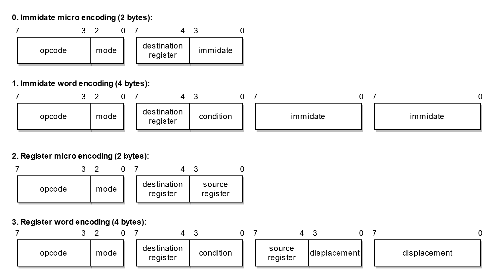

# The Kora 32-bit Processor
The Kora processor is a simple 32-bit CISC processor with RISC features

## Pages that inspired the Kora processor
- https://en.wikipedia.org/wiki/Intel_8086
- https://en.wikipedia.org/wiki/ARM_architecture
- https://en.wikipedia.org/wiki/RISC-V
- https://en.wikipedia.org/wiki/Motorola_68000
- https://en.wikipedia.org/wiki/X86_instruction_listings
- http://unixwiz.net/techtips/x86-jumps.html

## Features
- A new simple 32-bit CISC design with RISC features like the [Neva processor](https://github.com/bplaat/neva-processor)
- 32-bit internal address bus
- 8-bit external data bus
- Small, simple, orthogonal, load / store instruction set
- Variable instruction length (2 bytes or 4 bytes) for smaller program size
- All external I/O must be memory based
- Room to be expanded with more instructions

## Insperations
- Many registers for an efficient calling convention: ARM, RISC-V
- Memory access only in special load / store instructions: ARM, RISC-V
- Most instruction names, pseudo instructions and assembler style: x86
- Flags and jump condition combinations: x86

## Instruction encoding
Every instruction has an opcode and a mode. The mode are two bits that describe how the instruction must be parsed and executed:
```
bit 0 = Small/Large
bit 1 = Register/Immediate
```



## Registers
The Kora processor has way more registers than the Neva processor, this ensures that code can better be optimized. All registers have names and are used by the Kora ABI in a specific way:

<table>
<tr><th>#</th><th>Names</th><th>Meaning (calling convention)</th></tr>

<tr><td colspan="3"><i>Temporary registers:</i></td></tr>
<tr><td>0</td><td><code>t0</code></td><td>Temporary variable 1 / Variable arguments count</td></tr>
<tr><td>1</td><td><code>t1</code></td><td>Temporary variable 2</td></tr>
<tr><td>2</td><td><code>t2</code></td><td>Temporary variable 3</td></tr>
<tr><td>3</td><td><code>t3</code></td><td>Temporary variable 4</td></tr>
<tr><td colspan="3"></td></tr>

<tr><td colspan="3"><i>Saved registers:</i></td></tr>
<tr><td>4</td><td><code>s0</code></td><td>Saved variable 1</td></tr>
<tr><td>5</td><td><code>s1</code></td><td>Saved variable 2</td></tr>
<tr><td>6</td><td><code>s2</code></td><td>Saved variable 3</td></tr>
<tr><td>7</td><td> <code>s3</code></td><td>Saved variable 4</td></tr>
<tr><td colspan="3"></td></tr>

<tr><td colspan="3"><i>Argument registers:</i></td></tr>
<tr><td>8</td><td><code>a0</code></td><td>Function argument 1 / return value 1</td></tr>
<tr><td>9</td><td><code>a1</code></td><td>Function argument 2 / return value 2</td></tr>
<tr><td>10</td><td><code>a2</code></td><td>Function argument 3</td></tr>
<tr><td>11</td><td><code>a3</code></td><td>Function argument 4</td></tr>
<tr><td colspan="3"></td></tr>

<tr><td colspan="3"><i>Special registers:</i></td></tr>
<tr><td>12</td><td><code>bp</code></td><td>Stack base pointer</td></tr>
<tr><td>13</td><td><code>sp</code></td><td>Stack pointer</td></tr>
<tr><td>14</td><td><code>rp</code></td><td>Return pointer</td></tr>
<tr><td>15</td><td><code>flags</code></td><td>Flags</td></tr>

<tr><td colspan="3"><i>Inaccessible registers:</i></td></tr>
<tr><td>-</td><td><code>ip</code></td><td>Instruction pointer</td></tr>
</table>

## Flag register bits
The Kora processor has general flags and processor state flags, all flags are stored in the `flags` register:

<table>
<tr><th>#</th><th>Name</th><th>Meaning</th></tr>

<tr><td colspan="4"><i>General flags:</i></td></tr>
<tr><td>0</td><td>Carry</td><td>Is set when a carry overflow occurs</td></tr>
<tr><td>1</td><td>Zero</td><td>Is set when the result is zero</td></tr>
<tr><td>2</td><td>Sign</td><td>Is set when the highest sign bit is set</td></tr>
<tr><td>3</td><td>Overflow</td><td>Is set when a overflow occurs</td></tr>
<tr><td colspan="4"></td></tr>

<tr><td>4/7</td><td><i>Reserved</i></td><td>-</td></tr>
<tr><td colspan="4"></td></tr>

<tr><td colspan="4"><i>Processor state flags:</i></td></tr>
<tr><td>8</td><td>Halt</td><td>When set halts the processor</td></tr>
<tr><td colspan="4"></td></tr>

<tr><td>9/31</td><td><i>Reserved</i></td><td>-</td></tr>
</table>

## Opcodes
<table>
<tr><th>#</th><th>Name</th><th>Meaning</th><th>Operation</th><th>Flags</th></tr>

<tr><td colspan="5"><i>Move, load and store instructions (9):</i></td></tr>
<tr><td>0</td><td><code>mov</code></td><td>Move</td><td><code>dest = data</code></td><td>-</td></tr>
<tr><td>1</td><td><code>lw</code></td><td>Load word (32-bit)</td><td><code>dest = [data]</code></td><td>-</td></tr>
<tr><td>2</td><td><code>lh</code></td><td>Load half (16-bit)</td><td><code>dest = [data] & 0xffff</code></td><td>-</td></tr>
<tr><td>3</td><td><code>lhsx</code></td><td>Load half (16-bit) sign extended</td><td><code>dest = (sign extend)[data]</code></td><td>-</tr>
<tr><td>4</td><td><code>lb</code></td><td>Load byte (8-bit)</td><td><code>dest = [data] & 0xff</code></td><td>-</td></tr>
<tr><td>5</td><td><code>lbsx</code></td><td>Load byte (8-bit) sign extended</td><td><code>dest = (sign extend)[data]</code></td><td>-</td></tr>
<tr><td>6</td><td><code>sw</code></td><td>Store word (32-bit) to memory</td><td><code>[data] = dest</code></td><td>-</td></tr>
<tr><td>7</td><td><code>sh</code></td><td>Store half (16-bit) to memory</td><td><code>[data] = dest & 0xffff</code></td><td>-</td></tr>
<tr><td>8</td><td><code>sb</code></td><td>Store byte (8-bit) to memory</td><td><code>[data] = dest  & 0xff</code></td><td>-</td></tr>
<tr><td colspan="5"></td></tr>

<tr><td colspan="5"><i>Arithmetic instructions (6):</i></td></tr>
<tr><td>9</td><td><code>add</code></td><td>Add</td><td><code>dest += data</code></td><td><code>c</code>, <code>z</code>, <code>s</code>, <code>o</code></td></tr>
<tr><td>10</td><td><code>adc</code></td><td>Add with carry</td><td><code>dest += data + carry</code></td><td><code>c</code>, <code>z</code>, <code>s</code>, <code>o</code></td></tr>
<tr><td>11</td><td><code>sub</code></td><td>Subtract</td><td><code>dest -= data</code></td><td><code>c</code>, <code>z</code>, <code>s</code>, <code>o</code></td></tr>
<tr><td>12</td><td><code>sbb</code></td><td>Subtract with borrow</td><td><code>dest -= data + carry</code></td><td><code>c</code>, <code>z</code>, <code>s</code>, <code>o</code></td></tr>
<tr><td>13</td><td><code>neg</code></td><td>Negate</td><td><code>dest = -data</code></td><td><code>c</code>, <code>z</code>, <code>s</code>, <code>o</code></td></tr>
<tr><td>14</td><td><code>cmp</code></td><td>Arithmetic compare (sub)</td><td><code>dest - data (only set flags)</code></td><td><code>c</code>, <code>z</code>, <code>s</code>, <code>o</code></td></tr>
<tr><td colspan="5"></td></tr>

<tr><td colspan="5"><i>Bitwise instructions (8):</i></td></tr>
<tr><td>15</td><td><code>and</code></td><td>Logical and</td><td><code>dest &amp;= data</code></td><td><code>z</code>, <code>s</code></td></tr>
<tr><td>16</td><td><code>or</code></td><td>Logical or</td><td><code>dest |= data</code></td><td><code>z</code>, <code>s</code></td></tr>
<tr><td>17</td><td><code>xor</code></td><td>Logical xor</td><td><code>dest ^= data</code></td><td><code>z</code>, <code>s</code></td></tr>
<tr><td>18</td><td><code>not</code></td><td>Logical not</td><td><code>dest = ~data</code></td><td><code>z</code>, <code>s</code></td></tr>
<tr><td>19</td><td><code>test</code></td><td>Bitwise compare (and)</td><td><code>dest &amp; data (only set flags)</code></td><td><code>z</code>, <code>s</code></td></tr>
<tr><td>20</td><td><code>shl</code></td><td>Logical shift left</td><td><code>dest &lt;&lt;= (data + 1) &amp; 31</code></td><td><code>z</code>, <code>s</code></td></tr>
<tr><td>21</td><td><code>shr</code></td><td>Logical shift right</td><td><code>dest &gt;&gt;= (data + 1) &amp; 31</code></td><td><code>z</code>, <code>s</code></td></tr>
<tr><td>22</td><td><code>sar</code></td><td>Arithmetic shift right</td><td><code>dest &gt;&gt;&gt;= (data + 1) &amp; 31</code></td><td><code>z</code>, <code>s</code></td></tr>
<tr><td colspan="5"></td></tr>

<tr><td colspan="5"><i>Jump instructions (1):</i></td></tr>
<tr><td>23 0*</td><td><code>jmp</code></td><td>Relative jump</td><td>reg mode: <code>ip = data</code><br>imm mode: <code>ip += data << 1</code></td><td>-</td></tr>
<tr><td>23 1*</td><td><code>call</code></td><td>Relative call</td><td>reg mode: <code>rp = ip, ip = data</code><br>imm mode: <code>rp = ip, ip += data << 1</code></td><td>-</td></tr>
<tr><td>23 2*</td><td><code>jc</code></td><td>Relative jump carry</td><td><code>if (carry) ip += data << 1</code></td><td>-</td></tr>
<tr><td>23 3*</td><td><code>jnc</code></td><td>Relative jump not carry</td><td><code>if (!carry) ip += data << 1</code></td><td>-</td></tr>
<tr><td>23 4*</td><td><code>jz</code></td><td>Relative jump zero</td><td><code>if (zero) ip += data << 1</code></td><td>-</td></tr>
<tr><td>23 5*</td><td><code>jnz</code></td><td>Relative jump not zero</td><td><code>if (!zero) ip += data << 1</code></td><td>-</td></tr>
<tr><td>23 6*</td><td><code>js</code></td><td>Relative jump sign</td><td><code>if (sign) ip += data << 1</code></td><td>-</td></tr>
<tr><td>23 7*</td><td><code>jns</code></td><td>Relative jump not sign</td><td><code>if (!sign) ip += data << 1</code></td><td>-</td></tr>
<tr><td>23 8*</td><td><code>jo</code></td><td>Relative jump overflow</td><td><code>if (overflow) ip += data << 1</code></td><td>-</td></tr>
<tr><td>23 9*</td><td><code>jno</code></td><td>Relative jump not overflow</td><td><code>if (!overflow) ip += data << 1</code></td><td>-</td></tr>
<tr><td>23 10*</td><td><code>ja</code></td><td>Relative jump above</td><td><code>if (!carry &amp;&amp; !zero) ip += data << 1</code></td><td>-</td></tr>
<tr><td>23 11*</td><td><code>jna</code></td><td>Relative jump not above</td><td><code>if (carry || zero) ip += data << 1</code></td><td>-</td></tr>
<tr><td>23 12*</td><td><code>jl</code></td><td>Relative jump less</td><td><code>if (sign != overflow) ip += data << 1</code></td><td>-</td></tr>
<tr><td>23 13*</td><td><code>jnl</code></td><td>Relative jump not less</td><td><code>if (sign == overflow) ip += data << 1</code></td><td>-</td></tr>
<tr><td>23 14*</td><td><code>jg</code></td><td>Relative jump greater</td><td><code>if (zero &amp;&amp; (sign == overflow)) ip += data << 1</code></td><td>-</td></tr>
<tr><td>23 15*</td><td><code>jng</code></td><td>Relative jump not greater</td><td><code>if (!zero || (sign != overflow)) ip += data << 1</code></td><td>-</td></tr>
<tr><td colspan="5"></td></tr>

<tr><td colspan="5"><i>Reserved instructions (40):</i></td></tr>
<tr><td>24/63</td><td><i>Reserved</i></td><td>-</td><td>-</td><td>-</td></tr>
</table>

**With the jmp instruction all conditions are encoded in the destination register part of the instruction. All jump instructions can be relative or absolute*

## Pseudo instructions
There are also some pseudo instructions which the assembler translates to other instructions, most pseudo instructions are used to make the Kora assembler look more like x86 assembler:

<table>
<tr><th>Name</th><th>Meaning</th><th>Example</th><th>Translation</th></tr>

<tr><td colspan="4"><i>Move load store helpers:</i></td></tr>
<tr><td><code>mov reg, word [?]</code></td><td>Move load word</td><td><code>mov t0, word [0xbeef]</code></td><td><code>lw t0, 0xbeef</code></td></tr>
<tr><td><code>mov reg, half [?]</code></td><td>Move load half</td><td><code>mov t0, half [0xbeef]</code></td><td><code>lh t0, 0xbeef</code></td></tr>
<tr><td><code>movsx reg, half [?]</code></td><td>Move load half sign extended</td><td><code>movsx t0, half [0xbeef]</code></td><td><code>lhsx t0, 0xbeef</code></td></tr>
<tr><td><code>mov reg, byte [?]</code></td><td>Move load byte</td><td><code>mov t0, byte [0xbeef]</code></td><td><code>lb t0, 0xbeef</code></td></tr>
<tr><td><code>movsx reg, byte [?]</code></td><td>Move load byte sign extended</td><td><code>movsx t0, byte [0xbeef]</code></td><td><code>lbsx t0, 0xbeef</code></td></tr>
<tr><td><code>mov word [?], reg</code></td><td>Move store word</td><td><code>mov word [0xbeef], t0</code></td><td><code>sw t0, 0xbeef</code></td></tr>
<tr><td><code>mov half [?], reg</code></td><td>Move store half</td><td><code>mov half [0xbeef], t0</code></td><td><code>sh t0, 0xbeef</code></td></tr>
<tr><td><code>mov byte [?], reg</code></td><td>Move store byte</td><td><code>mov byte [0xbeef], t0</code></td><td><code>sb t0, 0xbeef</code></td></tr>
<tr><td colspan="4"></td></tr>

<tr><td colspan="4"><i>More jumps:</i></td></tr>
<tr><td><code>jb</code></td><td>Jump below</td><td><code>jb label</code></td><td><code>jc label</code></td></tr>
<tr><td><code>jnae</code></td><td>Jump not above or equal</td><td><code>jnae label</code></td><td><code>jc label</code></td></tr>
<tr><td><code>jnb</code></td><td>Jump not below</td><td><code>jb label</code></td><td><code>jnc label</code></td></tr>
<tr><td><code>jae</code></td><td>Jump above or equal</td><td><code>jae label</code></td><td><code>jnc label</code></td></tr>
<tr><td><code>je</code></td><td>Jump equal</td><td><code>je label</code></td><td><code>jz label</code></td></tr>
<tr><td><code>jne</code></td><td>Jump not equal</td><td><code>jne label</code></td><td><code>jnz label</code></td></tr>
<tr><td><code>jnbe</code></td><td>Jump not below or equal</td><td><code>jnbe label</code></td><td><code>ja label</code></td></tr>
<tr><td><code>jbe</code></td><td>Jump below or equal</td><td><code>jbe label</code></td><td><code>jna label</code></td></tr>
<tr><td><code>jnge</code></td><td>Jump not greater or equal</td><td><code>jnge label</code></td><td><code>jl label</code></td></tr>
<tr><td><code>jge</code></td><td>Jump greater or equal</td><td><code>jge label</code></td><td><code>jnl label</code></td></tr>
<tr><td><code>jnle</code></td><td>Jump not less or equal</td><td><code>jnle label</code></td><td><code>jg label</code></td></tr>
<tr><td><code>jle</code></td><td>Jump less or equal</td><td><code>jle label</code></td><td><code>jng label</code></td></tr>
<tr><td colspan="4"></td></tr>

<tr><td colspan="4"><i>Other helpers:</i></td></tr>
<tr><td><code>inc</code></td><td>Increment register</td><td><code>inc t0</code></td><td><code>add t0, 1</code></td></tr>
<tr><td><code>dec</code></td><td>Decrement register</td><td><code>dec t0</code></td><td><code>sub t0, 1</code></td></tr>
<tr><td><code>hlt</code></td><td>Set halt flag</td><td><code>hlt</code></td><td><code>or flags, 1 << 8</code></td></tr>
<tr><td><code>ret</code></td><td>Return from function</td><td><code>ret</code></td><td><code>jmp rp</code></td></tr>

</table>

## Assembly examples
Here are some assembly examples:
```asm
; memcpy, memset, memcmp
memcpy:
    ; a0 = dest
    ; a1 = src
    ; a2 = size
    mov t0, a0
    add t0, a2
.repeat:
    cmp a0, t0
    je .done
    mov t1, byte [a1]
    mov byte [a0], t1
    inc a0
    inc a1
    jmp .repeat
.done:
    ret
```
```asm
memset:
    ; a0 = dest
    ; a1 = value
    ; a2 = size
    mov t0, a0
    add t0, a2
.repeat:
    cmp a0, t0
    je .done
    mov byte [a0], a1
    inc a0
    jmp .repeat
.done:
    ret
```

```asm
; strlen, strcpy, strcat, strcmp
strlen:
    ; a0 = str
    mov t0, a0
.repeat:
    mov t1, byte [a0]
    cmp t1, 0
    je .done
    inc a0
    jmp .repeat
.done:
    sub a0, t0
    ret
```
```asm
strcpy:
    ; a0 = dest
    ; a1 = src
.repeat:
    mov t0, byte [a1]
    cmp t0, 0
    je .done
    mov byte [a0], t0
    inc a0
    inc a1
    jmp .repeat
.done:
    ret
```
```asm
strcat:
    ; a0 = dest
    ; a1 = src
    mov s0, rp
.repeat:
    mov t0, byte [a0]
    cmp t0, 0
    je .done
    inc a0
    jmp .repeat
.done:
    call strcpy
    jmp s0 ; ret
```
