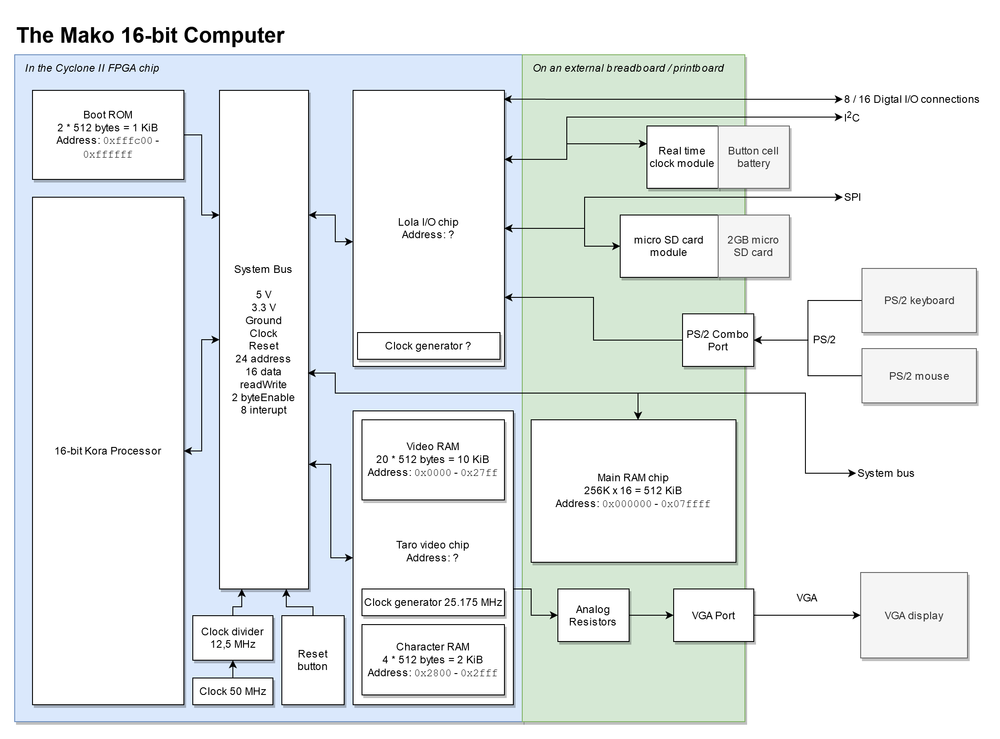

# The Mako Computer System
A simple complete system with the Kora, Lola and Taro chips

And a 512 KiB RAM chip with some ports

## Components
- The Kora 16-bit Processor
- The Lola I/O chip
- The Taro video chip
- An 512 KiB RAM chip
- Real time I2C clock
- Two PS/2 ports
- VGA port
- Micro-SD card slot
- Digital I/O lines

## Design
This a simple diagram of the complete design of the Mako computer system:

